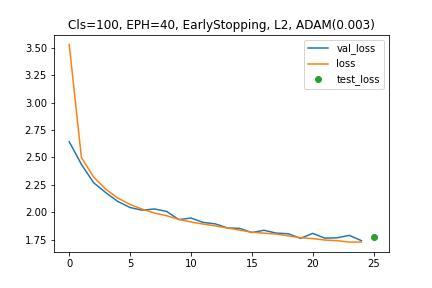
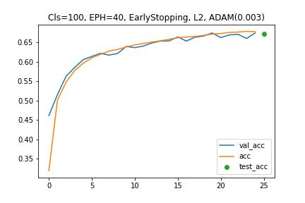

# Prepoznavanje skica
## Autori: Božidar Mitrović 1041/2021 i Luka Vujčić 1015/2021

## Opis problema
Napraviti model koji sto bolje radi klasifikaciju skica i pribliziti se _state of the art_ rezultatima sto je moguce vise!   

## Skup podataka
 * _quickdraw_bitmap_ dataset iz `tensorflow_datasets` biblioteke.
 * slike dimenzije (28, 28, 1)
 * velicina skupa: 35GB

## Rezultati
### Funkcija greske

### Preciznost
